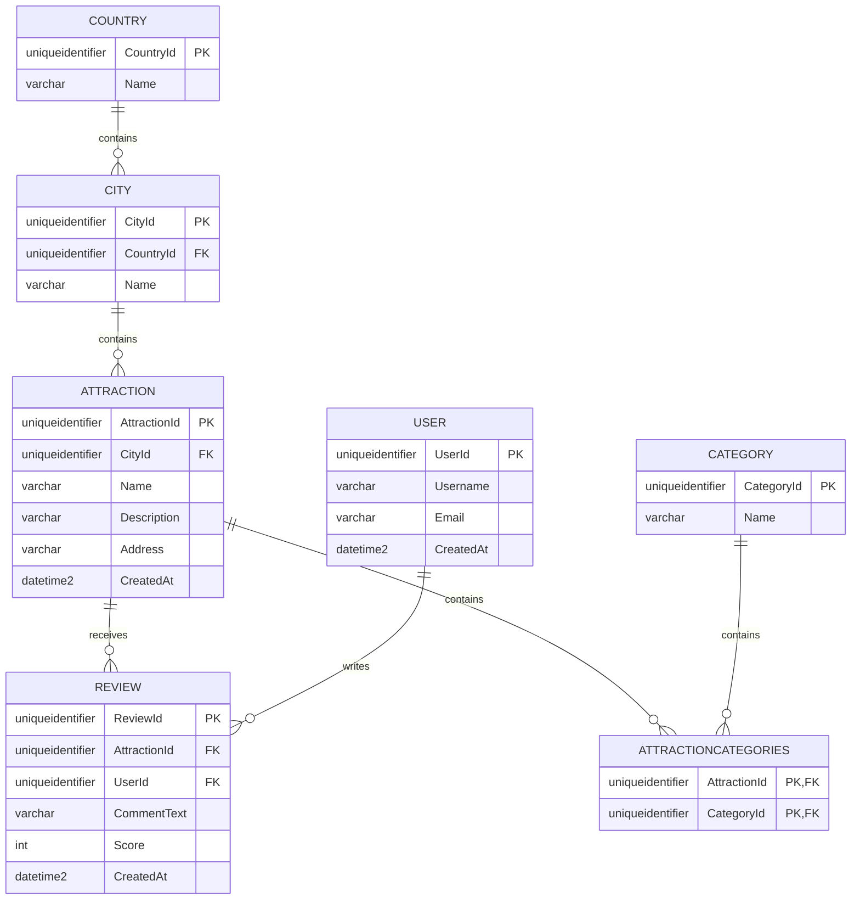

# Travel ERD TOMAS RUNNVIK - Projekt.
 Då jag utgått ifrån vår förra kurs med databasprojektet har jag följt samma struktur. 
Modeller: `Country`, `City`, `Attraction`, `Category`, `Review` och `User`.

 Ett land kan ha flera cities 1-* en till många.

 En stad kan ha flera attractions 1-* en till många.

 En attraktion kan ha flera reviews 1-* en till många.

 En användare kan skriva flera reviews 1-* en till många
 .
 En attraktion kan tillhöra flera categories *-* många till många.

 Använder uniqueidentifier/Guid som primärnyckel för alla tabeller för att säkerställa globala unika identifierare.

 Attractions och categories har en många-till-många-relation via en junction table.

