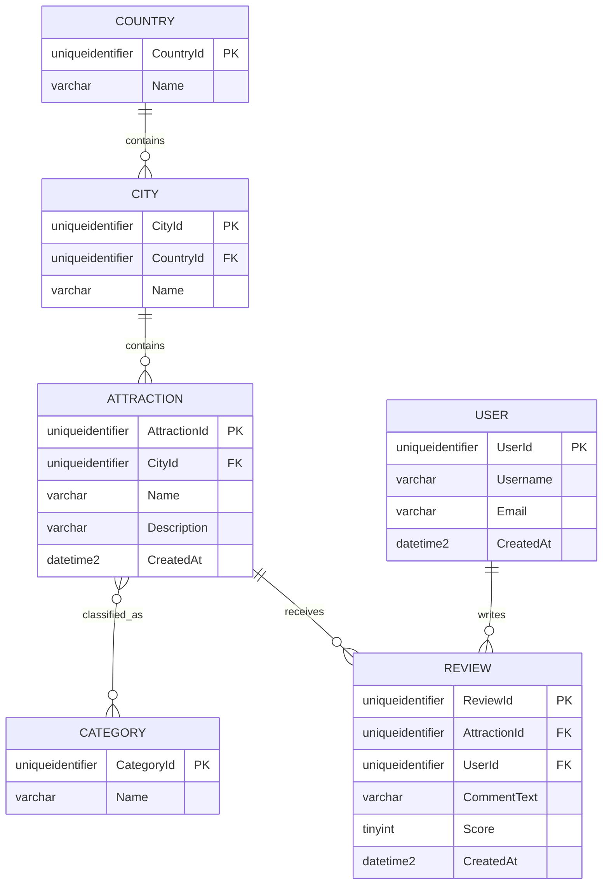

# Travel database ERD

The model uses one-to-many relationships for countries/cities, cities/attractions, attractions/reviews, and users/reviews. Attractions and categories use an EF Core many-to-many relationship through the generated `AttractionCategories` junction table.

